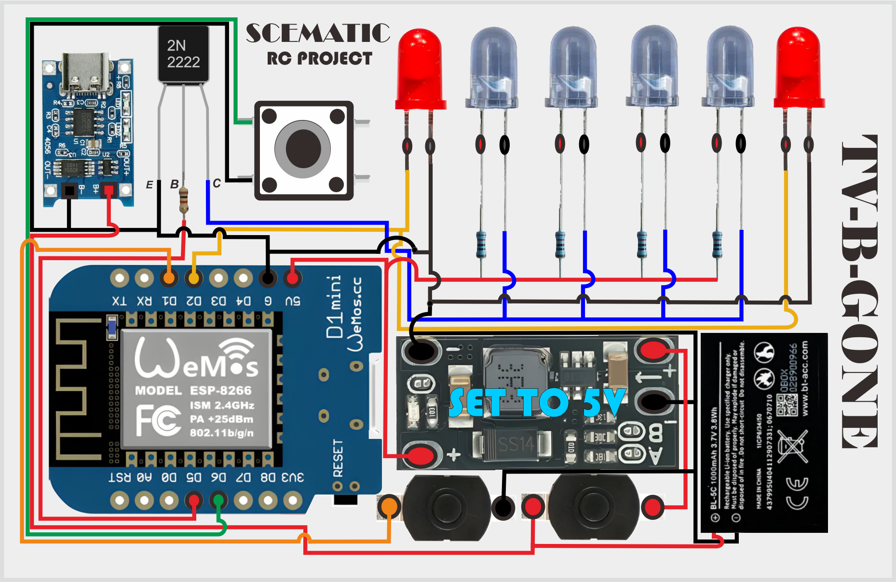

# 🔥 DIY TV-B-GONE HackTool | ESP8266 IR Remote Blaster 🔥

Hack semua TV hanya dengan satu tombol!  
TV-B-Gone ini dibangun menggunakan ESP8266 (Wemos D1 Mini) dan bisa mematikan hampir semua merek TV populer dalam waktu singkat.

 <!-- Ganti ini sesuai link gambar skema -->

---

## 📢 FITUR UTAMA:

- 🚨 Matikan TV apapun hanya dengan 1 tombol!
- 📡 Jangkauan hingga 3M (tergantung IR LED & driver)
- 🔄 Kompatibel dengan hampir semua merek: Samsung, LG, Polytron, Sony, Changhong, Tanaka, dll
- 🔋 Ditenagai dari baterai BL-5C atau LiPo 3.7V dengan sistem charge otomatis
- 🎨 Dilengkapi LED variasi agar tampil gaya saat digunakan

---

## 📄 TERINSPIRASI DARI

📌 Project original oleh [agrimpelhuber](https://github.com/agrimpelhuber/esp8266-tvbgone)  
🛠️ Dimodifikasi dan dikembangkan ulang oleh **APTECH** untuk lebih fleksibel dan estetik 💥

---

## 🧰 BAHAN-BAHAN & KOMPONEN

| No. | Komponen                                                                 | Jumlah |
|-----|--------------------------------------------------------------------------|--------|
| 1.  | Charger TP4056                                                           | 1x     |
| 2.  | Step Up 3.7V to 5V Mini                                                   | 1x     |
| 3.  | Saklar ON/OFF Mini (12×8mm DC 30V 1A)                                    | 2x     |
| 4.  | LED variasi merah 5mm                                                    | 2x     |
| 5.  | IR LED 940nm 5mm                                                         | 4x     |
| 6.  | Wemos D1 Mini (ESP8266)                                                  | 1x     |
| 7.  | Baterai BL-5C / Polymer 3.7V (1800mAh disarankan)                        | 1x     |
| 8.  | Push Button Taktil (untuk tombol trigger utama)                          | 1x     |
| 9.  | Resistor 2K                                                              | 1x     |
| 10. | Resistor 220Ω                                                            | 4x     |
| 11. | Transistor 2N2222                                                        | 1x     |

---

## 🔧 RANGKAIAN & PINOUT
📌 Deskripsi skema singkat: D5 → Resistor 220Ω → Basis Transistor  
Emitor Transistor → GND  
Kolektor Transistor → Katoda IR LED  
Anoda IR LED → +5V dari Step-Up  

LED variasi merah → dipasang paralel IR LED sebagai indikator

Push Button utama → Salah satu kaki ke GND  
Kaki lain → ke GPIO D6 (bisa diubah sesuai sketch)

---

📌 Skema lengkap lihat gambar di atas ☝️

---

## 🎬 CARA PAKAI

1. Upload Firmware bin ke esp8266 flasher pilhan mu
2. Sambungkan baterai 3.7V
3. Tekan tombol utama → TV di sekitar langsung OFF!  
4. LED variasi berkedip sebagai indikator power IR

---

## 💌 KONTAK & DUKUNGAN

📲 Telegram: [@aryaputra25](https://t.me/RClCOMUNITYIOFFICIAL)  
☕ Saweria (jika ingin mendukung developer):  
https://saweria.co/rcprojectskyproject

---

## 🧨 PENTING UNTUK FLASHING & MODIFIKASI

Jika kamu hanya ingin langsung pakai,  
silakan **download file firmware `.bin`** dari halaman [📦 Releases](https://github.com/USERNAME/REPO-NAME/releases](https://github.com/aryaexeuyf/TV-B-GONE/releases/tag/V1.0.0) yang sudah saya sediakan.

> ⚠️ **Gunakan ESP8266 Flasher favoritmu**, misalnya:
> - NodeMCU Flasher
> - ESPTool GUI
> - Flash Download Tool v3.6

Pastikan kamu memilih port COM yang benar, lalu flash file `.bin` yang sudah tersedia tanpa perlu repot compile ulang!

---

## ⚙️ INGIN MODIFIKASI ATAU RIKUES FITUR?

Saya **tidak mempublikasikan file `.ino` atau source modifikasi langsung**,  
karena ini adalah pengembangan dari versi original milik [agrimpelhuber](https://github.com/agrimpelhuber/esp8266-tvbgone)

💸 Kamu bisa **menggunakan jasa edit hanya dengan 1000 rupiah saja**,  

📲 **PM saya** jika tertarikk

---

## 📘 LICENSE

This project is licensed under [MIT License](LICENSE)

---

🔥 Jangan lupa kasih ⭐ star kalau kamu suka project ini!  

---

## 🤝 Credits

- Dibuat oleh: **ARYA25**
- dukungan : *RC-PROJECT*
- Dibantu AI: ChatGPT,Gemini Pro
- Terinspirasi dari: agrimpelhuber,Nethercap, Deauther, ESP32 Tools , & ESP8266 Tools
